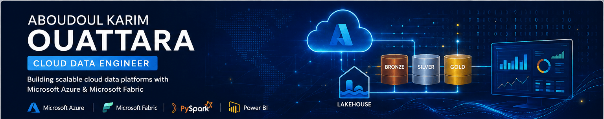

  <!-- 🔥 BANNIÈRE -->
  

<h2>👨‍💻 About Me</h2>

I design and build modern data platforms that transform raw data into reliable, business-ready insights.

My work focuses on designing end-to-end data solutions using <b>Microsoft Azure</b>, <b>Microsoft Fabric</b>, <b>PySpark</b>, and <b>Power BI</b>, following best practices such as <b>Lakehouse Architecture</b>, <b>Medallion Architecture</b>, and scalable ETL/ELT pipelines.

I enjoy solving data challenges by creating robust, maintainable, and scalable architectures that help organizations make data-driven decisions.

<h2>

<h2>🚀 What I Build</h2>

<ul>
  <li>End-to-End Data Platforms</li>
  <li>Azure Data Engineering Solutions</li>
  <li>Microsoft Fabric Lakehouses</li>
  <li>ETL / ELT Pipelines</li>
  <li>Lakehouse Architectures</li>
  <li>Data Transformation with PySpark</li>
  <li>Business Analytics & Reporting</li>
  <li>Power BI Semantic Models</li>
  <li>Cloud Data Warehousing</li>
</ul>

<h2>

<h2>⭐ Featured Projects</h2>

<h3>🚀 Azure End-to-End Data Platform</h3>

<ul>
  <li>Azure Data Factory orchestration</li>
  <li>Azure Data Lake Storage Gen2</li>
  <li>Azure Databricks (PySpark)</li>
  <li>Medallion Architecture</li>
  <li>Business-ready Gold Layer</li>
  <li>Interactive Power BI Dashboard</li>
</ul>

  

<h3>🚀 Microsoft Fabric Lakehouse</h3>

<ul>
  <li>OneLake</li>
  <li>Lakehouse</li>
  <li>Dataflow Gen2</li>
  <li>Fabric Notebooks</li>
  <li>Semantic Model</li>
  <li>Power BI Report</li>
  <li>Business KPIs</li>
</ul>

  

<h2>

<h2>🏗️ Engineering Principles</h2>

<ul>
  <li>Scalable Cloud Architecture</li>
  <li>Modular & Reusable Pipelines</li>
  <li>Medallion Architecture Design</li>
  <li>Data Quality & Validation</li>
  <li>Business-Oriented Data Modeling</li>
  <li>Performance Optimization</li>
  <li>Documentation First</li>
  <li>Maintainable Code</li>
  <li>Analytics-Ready Data</li>
</ul>

<h2>

<h2>🛠️ Tech Stack</h2>

<ul>
  <li>Microsoft Azure</li>
  <li>Microsoft Fabric</li>
  <li>Azure Data Factory</li>
  <li>Azure Databricks</li>
  <li>Azure Data Lake Storage Gen2</li>
  <li>OneLake</li>
  <li>Python / PySpark / SQL</li>
  <li>Power BI</li>
  <li>Git & GitHub</li>
</ul>

<h2>

<h2>📚 Currently Exploring</h2>

<ul>
  <li>Microsoft Fabric Advanced Features</li>
  <li>Eventstream & Real-Time Intelligence</li>
  <li>Fabric Pipelines Optimization</li>
  <li>Advanced Spark Performance Tuning</li>
  <li>Modern Data Warehouse Architectures</li>
</ul>

<h2>

<h2>🤝 Let's Connect</h2>

💼 LinkedIn: <a href="https://www.linkedin.com/in/aboudoul-karim-ouattara-5baaba226/">My LinkedIn</a> 
📧 Email: <a href="mailto:ouattaraaboudoulkarim@gmail.com">ouattaraaboudoulkarim@gmail.com</a>

<h2>

<blockquote>
  <b>Turning raw data into scalable cloud solutions and trusted business insights.</b>
</blockquote>
